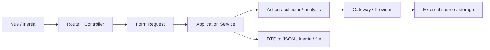

# Free Search

Free Search is a modular OSINT platform built with Laravel, Inertia.js, and Vue for searching, collecting, normalizing, and analysing open-source data.

> **Project Status: Beta.** The project is under active development. Internal APIs and interfaces may change, modules have different maturity levels, and integrations depend on third-party availability and policies. Production deployment requires an independent configuration, security, and source-limit review.

[Русская версия](README.md) · [Documentation index (Russian)](docs/README.md) · [Quick start (Russian)](docs/getting-started.md)

## Current capabilities

- Telegram, YouTube, Bluesky, and Mastodon: Search, Analytics, background Parser Runs, history, stop, JSON and Excel exports.
- Site Intel: HTTP/DNS/SSL checks, WHOIS-based Domain Lite, analytics, SEO Audit, and HTML reports.
- News / Media Intel: NewsAPI, Google News RSS, and Bing RSS aggregation with deduplication and lightweight heuristic analysis.
- Shifr: hashing, text transforms, IOC extraction, JWT inspection, and classic ciphers.
- Dashboard with activity history, summaries, pinned modules, and saved queries.
- Fortify authentication, email verification, 2FA, subscriptions, daily Feature Access quotas, and a separate MoonShine admin panel.

All areas are Beta. Telegram requires a MadelineProto session; YouTube depends on Data API quotas; Bluesky requires credentials; Site Intel performs active network requests; News analysis is heuristic. See [project status](docs/project/status.md).

## Stack

- PHP `^8.3`, Laravel `^13.0`, Fortify, MoonShine 4
- Vue 3, TypeScript, Inertia.js 3, Vite 8, Tailwind CSS 4
- MadelineProto, YouTube Data API v3, Bluesky AT Protocol, Mastodon API, RSS/NewsAPI
- PHPUnit 12, Vitest 4, Pint, ESLint, Prettier, vue-tsc

## Architecture

The codebase uses a pragmatic modular Laravel architecture rather than one uniform Clean Architecture or DDD template. Controllers and Form Requests lead into module Application Services; Actions, DTOs, gateway/provider contracts, collectors, presenters, and infrastructure adapters are used according to each module's needs. Shared Parser Run and Excel export infrastructure lives under `app/Modules`.



See the [architecture overview](docs/architecture/overview.md) and [Parser Run lifecycle](docs/architecture/parser-runs.md).

## Requirements and quick start

CI uses PHP 8.3, Composer 2, and Node.js 22.

```bash
composer install
npm install
cp .env.example .env
php artisan key:generate
php artisan migrate
composer run dev
```

For SQLite, ensure `database/database.sqlite` exists before migration. `composer run dev` starts the Laravel server, `queue:listen --tries=1`, and Vite.

## Configuration

- Telegram: `TELEGRAM_API_ID`, `TELEGRAM_API_HASH`, and a local MadelineProto session.
- YouTube: `YOUTUBE_DATA_API_KEY`.
- Bluesky: `BLUESKY_IDENTIFIER`, `BLUESKY_APP_PASSWORD`, `BLUESKY_PDS_URL`.
- Mastodon: `MASTODON_API_BASE_URL`, optionally `MASTODON_API_TOKEN`.
- NewsAPI: `OSINT_NEWSAPI_KEY`; RSS providers can operate without it.
- Parser Runs: `PARSER_RUN_*`; a worker is required when queue execution is enabled.
- MoonShine: production domain/prefix, allowlist, and throttling use `MOONSHINE_*`.

The complete reference is maintained in Russian: [Configuration](docs/configuration.md).

## Development and operations

```bash
composer run test
npm run test:unit
npm run quality:check
npm run build
php artisan queue:work
php artisan schedule:run
```

Read [Development](docs/development.md), [Testing](docs/testing.md), [Deployment](docs/deployment.md), and [Security](docs/security.md). Do not commit `.env`, API credentials, MadelineProto sessions, or Parser Run data.

## License

`composer.json` declares MIT. Confirm project licensing, asset rights, and external-data policies before a public release.
