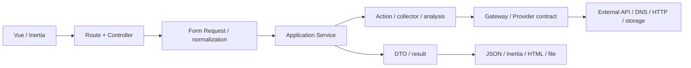

# Free Search

Free Search — модульная OSINT-платформа на Laravel, Inertia.js и Vue для поиска, сбора, нормализации и анализа данных из открытых источников.

> **Project Status: Beta.** Проект активно развивается. Внутренние API и интерфейсы могут меняться, зрелость модулей различается, а внешние интеграции зависят от доступности и правил сторонних сервисов. Production-развёртывание требует отдельной проверки конфигурации, безопасности и лимитов источников.

[English version](README.en.md) · [Документация](docs/README.md) · [Быстрый старт](docs/getting-started.md)

## Возможности

- Telegram, YouTube, Bluesky и Mastodon: Search, Analytics и фоновые Parser Runs с историей, остановкой и экспортом JSON/Excel.
- Site Intel: HTTP/DNS/SSL-проверки, WHOIS-based Domain Lite, агрегированная аналитика и SEO Audit с HTML-отчётами.
- News / Media Intel: агрегирование NewsAPI, Google News RSS и Bing RSS, дедупликация, timeline, темы и словарная sentiment-оценка.
- Shifr: хеширование, преобразования текста, извлечение IOC, просмотр JWT и классические шифры.
- Dashboard: журнал действий, сводки, закреплённые модули и сохранённые запросы.
- Fortify authentication, email verification, 2FA, подписки и дневные Feature Access quotas.
- Отдельная MoonShine admin panel для пользователей, подписок, токенов активации, очередей и журналов.

## Модули и зрелость

| Область | Реализовано | Текущий статус |
| --- | --- | --- |
| Telegram | Search, media, Analytics, Parser, JSON/Excel | Beta; требует MadelineProto-сессию |
| YouTube | Video Search, comments, Analytics, Parser, JSON/Excel | Beta; зависит от YouTube Data API quota |
| Bluesky | Search, actor/post relations, Analytics, Parser, JSON/Excel | Beta; требует Bluesky credentials |
| Mastodon | Search, account/status/tag data, Analytics, Parser, JSON/Excel | Beta; конфигурация требует проверки, см. [ограничения](docs/project/status.md) |
| Site Intel | Site Health, Domain Lite, Analytics, SEO Audit, HTML reports | Beta; активные сетевые проверки требуют production hardening |
| News / Media Intel | RSS/NewsAPI aggregation and lightweight analysis | Beta; эвристический анализ, без Parser/Export lifecycle |
| Shifr | Local toolkit and classic ciphers | Beta; не предназначен для хранения секретов |

Dashboard, Wiki, Export и Access/Subscriptions являются общими подсистемами, а не независимыми внешними источниками.

## Технологический стек

- PHP `^8.3`, Laravel `^13.0`, Fortify, MoonShine 4
- Vue 3, TypeScript, Inertia.js 3, Vite 8, Tailwind CSS 4
- database-backed cache/session/queue по умолчанию; SQLite в `.env.example`
- MadelineProto, YouTube Data API v3, Bluesky AT Protocol, Mastodon API, RSS/NewsAPI
- PHPUnit 12, Vitest 4, Pint, ESLint, Prettier, vue-tsc

## Архитектура

Проект использует прагматичную модульную архитектуру. HTTP-слой принимает и нормализует вход, Application Service координирует сценарий, а Actions, DTO, Gateway/Provider interfaces и infrastructure adapters используются там, где это подтверждено конкретным модулем. Структура модулей неодинакова: Site Intel и News / Media Intel явно разделяют `Application`, `Domain`, `Infrastructure`; social-модули используют `Search`, `Analytics`, `Parser`, `Actions`, `DTO` и `Support`.



Подробнее: [Architecture overview](docs/architecture/overview.md) и [Parser Runs](docs/architecture/parser-runs.md).

## Структура репозитория

```text
app/Modules/          OSINT-модули и shared Parser/Export infrastructure
app/Http/             Controllers, Form Requests, middleware
app/Services/         Dashboard, Access, Subscriptions и другие app-wide сценарии
app/Support/          Cross-cutting infrastructure
app/MoonShine/        Admin resources, pages и presentation helpers
config/osint/         Конфигурация модулей и Parser Runs
resources/js/         Vue/Inertia frontend, composables и Vitest tests
routes/               Public, authenticated, settings и scheduled routes
database/migrations/  Схема приложения
tests/                PHPUnit Feature и Unit tests
docs/                 Техническая документация
```

## Требования и быстрый старт

Точные CI-версии: PHP 8.3 и Node.js 22. Нужны Composer 2, npm и расширения PHP, требуемые зависимостями Composer.

```bash
composer install
npm install
cp .env.example .env
php artisan key:generate
php artisan migrate
composer run dev
```

`composer run dev` запускает Laravel server, `queue:listen --tries=1` и Vite. До миграции при SQLite убедитесь, что существует `database/database.sqlite`; скрипт `composer run setup` создаёт окружение и запускает миграции, но не создаёт SQLite-файл явно.

Полная инструкция: [Getting started](docs/getting-started.md).

## Основная конфигурация

Интеграции требуют только тех ключей, чьи модули используются:

- Telegram: `TELEGRAM_API_ID`, `TELEGRAM_API_HASH`, локальная MadelineProto session.
- YouTube: `YOUTUBE_DATA_API_KEY`.
- Bluesky: `BLUESKY_IDENTIFIER`, `BLUESKY_APP_PASSWORD`, `BLUESKY_PDS_URL`.
- Mastodon: `MASTODON_API_BASE_URL`, при необходимости `MASTODON_API_TOKEN`.
- NewsAPI: `OSINT_NEWSAPI_KEY`; RSS providers работают независимо от него.
- Parser Runs: `PARSER_RUN_*`; queue worker обязателен при `PARSER_RUN_QUEUE_ENABLED=true`.
- MoonShine: production route/domain, IP allowlist и login throttling задаются `MOONSHINE_*`.

Полная таблица: [Configuration](docs/configuration.md).

## Разработка и проверка

```bash
composer run test          # Pint check + PHPUnit
npm run test:unit          # Vitest
npm run quality:check      # Prettier, ESLint, vue-tsc, i18n
npm run build              # production frontend build
```

CI отдельно выполняет frontend quality, PHPUnit и production build. См. [Development](docs/development.md) и [Testing](docs/testing.md).

## Queue, Scheduler и эксплуатация

```bash
php artisan queue:work
php artisan schedule:run
php artisan app:cleanup-parser-runs --dry-run
php artisan app:create-telegram-session default
```

Scheduler ежедневно отправляет уведомления об окончании подписки (`09:00`) и очищает истёкшие Parser Runs (по умолчанию `03:30`). В production `schedule:run` должен вызываться инфраструктурным scheduler каждую минуту, а queue worker — работать постоянно.

См. [Queues and scheduler](docs/operations/queues-and-scheduler.md), [Deployment](docs/deployment.md) и [Telegram sessions](docs/operations/telegram-session.md).

## Security

Реализованы CSRF/session protection Laravel, validation через Form Requests, password hashing, email verification, 2FA, login throttling, блокировка пользователей, Feature Access middleware и отдельный MoonShine guard с production IP allowlist. Реализованные меры и production-рекомендации разделены в [Security](docs/security.md).

Не коммитьте `.env`, API credentials, MadelineProto sessions и Parser Run data. Использование источников должно соответствовать их API policies и применимому законодательству.

## Документация

- [Индекс документации](docs/README.md)
- [Архитектура](docs/architecture/overview.md)
- [Модули](docs/architecture/modules.md)
- [Parser Runs](docs/architecture/parser-runs.md)
- [Ошибки](docs/errors.md)
- [Статус и известные ограничения](docs/project/status.md)
- [Contributing](docs/project/contributing.md)

## License

`composer.json` указывает MIT. Перед публичным релизом необходимо подтвердить лицензионную политику проекта, права на assets и допустимость использования данных внешних источников.
