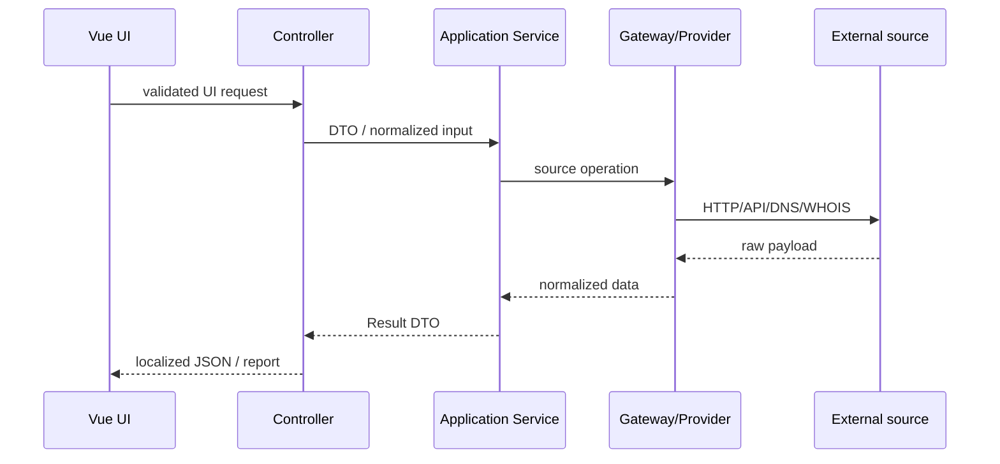

# Data flow

## Синхронный lookup

Shifr не вызывает external source. News fetcher fan-out вызывает несколько providers, затем service дедуплицирует и анализирует объединённые mentions. Site Intel analytics агрегирует отдельные network signals.

## Parser Run

Browser инициирует `start`; backend создаёт private state/DB metadata и dispatch job. Worker выполняет по одному step, обновляя cursor/data/snapshot. Browser polling читает status, а после terminal state запрашивает history или export. Подробнее: [Parser Runs](parser-runs.md).

## Dashboard и access

Web middleware логирует sanitized request metadata в `request_logs`. Dashboard services строят cards/feed/chart только для текущего user, добавляют saved queries и pins. Перед paid endpoints Feature Access разрешает staff bypass либо inspect/consume quota в `feature_usage_daily`; denial возвращает JSON 403/429 или redirect в billing.
