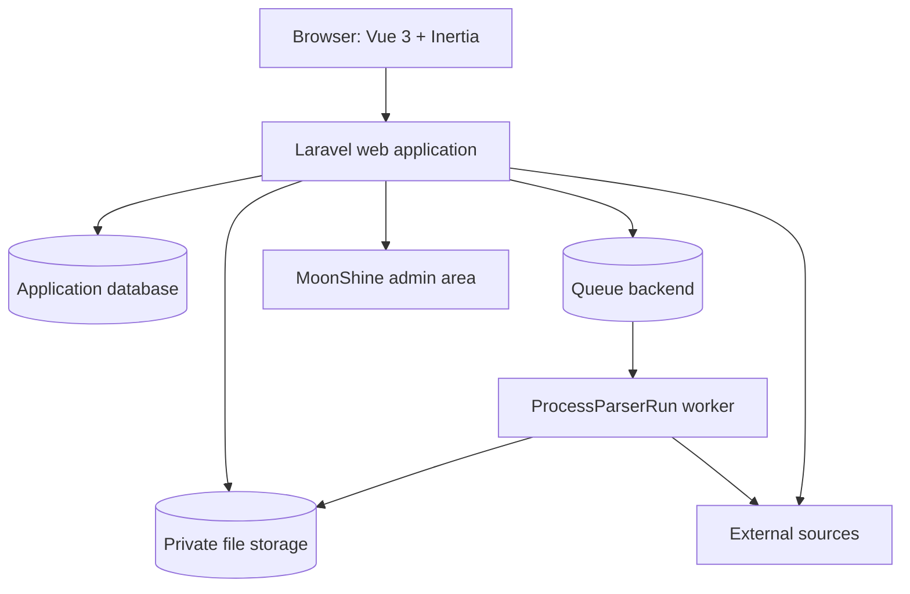
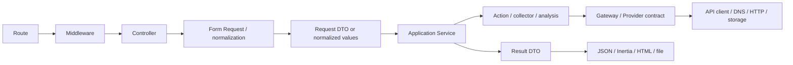

# Architecture overview

Free Search — Laravel monolith с Inertia/Vue frontend, module-oriented backend и shared application infrastructure. Это не единообразная Clean Architecture или DDD implementation: разные модули отражают разную историю и сложность, но транспорт, orchestration и external I/O обычно разделены.

## System context

## Request flow

Точный flow зависит от сценария. Shifr может закончиться на local Action; Site Intel идёт через Application contracts к Infrastructure clients; social Search/Analytics идёт через Application Service и Gateway; Parser стартует background lifecycle.

## Слои и ответственность

- **Routes/Middleware**: authentication, email verification, throttling и Feature Access. Route names также используются access policy и activity logging.
- **Controller**: вызывает один use case, выбирает response type и не обращается напрямую к external client.
- **Form Request**: validation, locale/boolean normalization и сборка request DTO. Не является domain layer.
- **Application Service**: orchestration use case и coordination нескольких Actions/collectors.
- **Action/analysis component**: узкая операция, mapping или вычисление.
- **Gateway/Provider interface**: порт для внешнего API/source. Site Intel и News используют Application contracts; social-модули имеют module-specific Gateway interfaces.
- **DTO**: явная форма входа, результата, Parser state/snapshot. DTO уменьшают зависимость transport от raw external payloads.
- **Infrastructure/Client**: HTTP, AT Protocol, Mastodon, YouTube, DNS, SSL, WHOIS, RSS, storage.
- **Presenter/Report builder/Export builder**: стабильная UI/file форма поверх результата.

## Module boundaries

Business/source-specific code находится в `app/Modules/<Module>`. Общие подсистемы: `ParserSupport`, `Export`, app-level `Services` (Dashboard, Access, Subscriptions), `Support` и MoonShine. Modules регистрируются Service Providers из `bootstrap/providers.php`; зависимости обычно направлены от HTTP к contract/application layer, затем к adapters.

## Shared runtime concerns

- `HandleInertiaRequests` передаёт auth/access/notification/frontend config в client.
- `LogUserActivity` и Dashboard services строят историю по `request_logs`.
- `EnsureFeatureAccess` inspect/consume daily quota по named route и `config/access.php`.
- `bootstrap/app.php` преобразует JSON exceptions в `{ok, message, code}` и validation errors.
- Scheduler и queue обслуживают Parser Runs и subscription notifications.
- MoonShine имеет отдельный auth guard и resources, но использует ту же application database.

## Dependency guidance

Сохраняйте подтверждённый pattern конкретного модуля. Новая source-specific логика должна жить внутри модуля; cross-module orchestration — в `app/Services`; reusable I/O/runtime mechanisms — в shared module/support. Domain/DTO code не должен зависеть от Controller. Не добавляйте interface только ради архитектурного ярлыка: interface оправдан external boundary или реальной заменяемостью.
