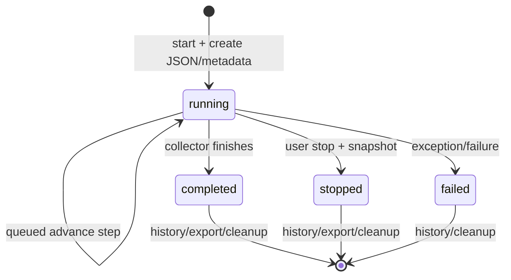

# Parser Run lifecycle

Общий lifecycle используется Telegram, YouTube, Bluesky и Mastodon.

## Start и execution

Application Service передаёт context в module `*ParserRunStore`. `ParserRunExecutionCoordinator` под cache lock не допускает второй active run того же module для пользователя, создаёт UUID/initial state, записывает JSON на private disk и синхронизирует `parser_runs` metadata. При queue mode dispatch идёт в `ProcessParserRun`.

Job выполняет один collector step и, если status всё ещё `running`, планирует следующий с `PARSER_RUN_QUEUE_STEP_DELAY_SECONDS`. Job имеет `tries=3`, timeout 120 seconds и unique id; Telegram steps дополнительно serialized через `WithoutOverlapping`. При выключенной queue status request сам вызывает один `advance`.

## State и storage

- Полный context/cursor/collected data/result snapshot: module JSON file на disk `private`.
- Index/history metadata: `parser_runs` (`run_id`, user, module, status, stage, progress, error, file details, timestamps/expiry).
- File mutation использует exclusive file lock; metadata синхронизируется после write.
- История из DB ограничена `PARSER_RUN_HISTORY_LIMIT` и user/module ownership.

Модульные stages различаются: Telegram собирает messages/comments; YouTube comments/replies; Bluesky profile/feed/followers/follows/interactions; Mastodon statuses/comments.

## Statuses

| Status | Terminal | Exportable | Meaning |
| --- | --- | --- | --- |
| `running` | нет | нет | Сбор продолжается |
| `completed` | да | да | Result snapshot завершён |
| `stopped` | да | да | Пользователь остановил; partial snapshot сохранён |
| `failed` | да | нет | Collector/job завершился ошибкой |

Stop действует только на `running`, строит snapshot при его отсутствии и не обязан выставлять progress 100. Неизвестное DB значение нормализуется моделью как `unknown`, но enum lifecycle его не создаёт.

## History и export

History Presenter объединяет DB metadata и доступный JSON payload. Download endpoint проверяет user ownership и downloadable status. JSON отдаёт stored result; Excel строится module-specific Export Builder поверх shared `ExcelWorkbookService`/sheet definitions.

## Cleanup и retention

Metadata synchronizer задаёт expiry по retention. Scheduled `app:cleanup-parser-runs` выбирает expired rows batches, удаляет соответствующий private file и DB row. `--dry-run` ничего не удаляет. Истёкшие runs не входят в history query.

## Failure modes

Misconfigured credentials, external API errors, quota/rate limit, malformed/expired file, worker downtime и timeout приводят к unavailable/stalled/failed flows. При queue mode простой worker оставляет run `running` до восстановления или ручного operational вмешательства; отдельного automatic stale-run reconciler в просмотренном коде нет.
