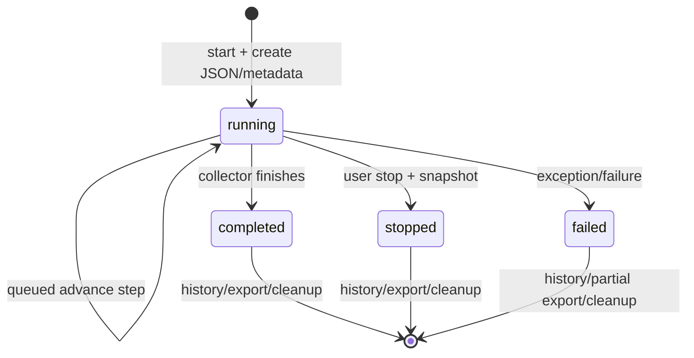

# Parser Run lifecycle

Общий lifecycle используется Telegram, YouTube, Bluesky и Mastodon.

```mermaid
stateDiagram-v2
    [*] --> running: start + create JSON/metadata
    running --> running: queued advance step
    running --> completed: collector finishes
    running --> failed: exception/failure
    running --> stopped: user stop + snapshot
    completed --> [*]: history/export/cleanup
    stopped --> [*]: history/export/cleanup
    failed --> [*]: history/partial export/cleanup
```

## Start и execution

Application Service передаёт context в module `*ParserRunStore`. `ParserRunExecutionCoordinator` под cache lock не допускает второй active run того же module для пользователя, создаёт UUID/initial state, записывает JSON на private disk и синхронизирует `parser_runs` metadata. При queue mode dispatch идёт в `ProcessParserRun`.

Job выполняет один collector step и, если status всё ещё `running`, планирует следующий с `PARSER_RUN_QUEUE_STEP_DELAY_SECONDS`. Таймаут составляет 120 секунд. Ошибка внешнего запроса в queue mode пробрасывается worker для повторения от последнего checkpoint; повторы ограничены тремя исключениями и часовым окном на шаг. Retry deadline хранится в JSON cursor и не обновляется при восстановлении зависшего шага. Ожидание `WithoutOverlapping` не считается исключением. При выключенной queue status request сам вызывает один `advance`; ошибка завершает его с partial snapshot.

## State и storage

- Полный context/cursor/collected data/result snapshot: module JSON file на disk `private`.
- Index/history metadata: `parser_runs` (`run_id`, user, module, status, stage, progress, error, file details, timestamps/expiry).
- `ParserRunFileStorage` сериализует запись через стабильный `.lock` в каталоге пользователя и атомарно заменяет JSON временным файлом из того же каталога. Читатель видит предыдущий или новый полный документ, не ожидая завершения collector step.
- Метаданные синхронизируются до освобождения блокировки. Очистка использует ту же блокировку и повторно проверяет срок хранения; при ошибке удаления запись сохраняется для следующей попытки. Нулевой файл `.lock` сохраняется как стабильный объект синхронизации.
- Внешние вызовы выполняются вне файловой блокировки под отдельным per-run execution lock. Запись шага применяется только если checkpoint всё ещё совпадает с прочитанным: остановка не ждёт сети, а поздний ответ не может перезаписать остановленный запуск.
- Job привязана к версии checkpoint и его retry deadline. Устаревшая job не применяет успешный шаг или failure callback к новой версии; uniqueness locks также разделены по версиям.
- История из DB ограничена `PARSER_RUN_HISTORY_LIMIT` и user/module ownership.

Модульные stages различаются: Telegram собирает messages/comments; YouTube comments/replies; Bluesky profile/feed/followers/follows/interactions; Mastodon statuses/comments.

## Регистрация нового parser module

Module Service Provider регистрирует собственный `JsonRunStore` с tag `JsonRunStore::CONTAINER_TAG` (`parser-run.stores`), а Application Service, реализующий `ParserRunBackgroundProcessorInterface`, с tag этого interface (`parser-run.background-processors`). Shared `ParserSupportServiceProvider` собирает оба registry из tagged services. `ParserRunJobDispatcher` выбирает store по его `module()` и читает durable checkpoint version/deadline перед созданием job. Списка source-specific stores в `AppServiceProvider` нет; новый module не требует правок shared dispatcher/provider.

Registry разрешают services при первом обращении, после регистрации module providers, и отклоняют duplicate или unknown module keys. Store и background processor должны возвращать одинаковый module key. Если новый источник использует opaque page cursors, DTO может использовать pure `PaginationCursorHistory`: источник определяет scopes, reset границы и форму JSON. Существующие YouTube/Mastodon checkpoints сохраняют списки tokens, Bluesky — scoped SHA-256 maps; миграция checkpoint files не требуется.

`JsonRunStore` принимает в file paths только UUID run IDs, созданные lifecycle. Некорректные IDs в read/mutate дают unavailable result до обращения к disk, write их отклоняет. Это закрывает обход user directory через slash/backslash traversal независимо от HTTP route validation.

## Statuses

| Status | Terminal | Exportable | Meaning |
| --- | --- | --- | --- |
| `running` | нет | нет | Сбор продолжается |
| `completed` | да | да | Result snapshot завершён |
| `stopped` | да | да | Пользователь остановил; partial snapshot сохранён |
| `failed` | да | при наличии snapshot | Collector/job завершился ошибкой; сохранённые результаты доступны как неполные |

Stop действует только на `running`, строит snapshot при его отсутствии и сохраняет текущий progress. Ошибка также сохраняет достигнутый progress; 100 означает успешное завершение. Поздний failure callback не меняет `stopped` или `completed`. Неизвестное DB значение нормализуется моделью как `unknown`, но enum lifecycle его не создаёт.

## History и export

History Presenter объединяет DB metadata и доступный JSON payload. Download endpoint проверяет user ownership, downloadable status и наличие snapshot. JSON включает `collection.status` и `collection.complete`; Excel показывает те же признаки в summary. `complete=false` отличает остановленные и ошибочные результаты от успешного сбора. Excel строится module-specific Export Builder поверх shared `ExcelWorkbookService`/sheet definitions.

## Полнота и пагинация

- Telegram не завершает историю по короткой странице; offset обязан двигаться к более старым сообщениям. Keyword и диапазон дат применяются совместно. Ошибка comments не превращается в успешную пустую страницу.
- YouTube проходит все страницы comments и replies, включая пустую промежуточную страницу с next token, и удаляет дубликаты embedded/fetched replies. История tokens сохраняется в checkpoint отдельно для comments и текущей reply thread.
- Mastodon сохраняет roots для comments со всех страниц statuses и восстанавливает их из уже сохранённых statuses старых checkpoints.
- Bluesky сохраняет frontier вложенных replies и догружает ветки глубже одного API-ответа; checkpoint хранит также feed/follower/follow/interaction cursors.

Повторяющийся cursor, цикл курсоров, недостоверный ответ или недоступная ветка вызывают явную ошибку, сохраняя предыдущий checkpoint, вместо зацикливания или ложного `completed`. Полнота относится к данным, доступным через API в выбранном сценарии; скрытые, удалённые и недоступные данные источник может не отдавать.

## Cleanup и retention

Metadata synchronizer задаёт expiry по retention. Scheduled `app:cleanup-parser-runs` выбирает expired rows batches, удаляет соответствующий private file и DB row. `--dry-run` ничего не удаляет. Истёкшие runs не входят в history query.

## Failure modes

Misconfigured credentials, external API errors, quota/rate limit, malformed/expired file и timeout приводят к unavailable/failed flows с partial snapshot, если checkpoint доступен.

`ParserRunRecovery` используется HTTP `start`/`status` и автономной командой `app:recover-parser-runs`, которую scheduler вызывает каждую минуту. Порог — `max(PARSER_RUN_RECOVERY_STALE_AFTER_SECONDS, 150 seconds, stepDelay + 30 seconds)`. Команда читает только DB metadata ограниченными `PARSER_RUN_RECOVERY_BATCH_SIZE` батчами по `id`; верхний ID фиксируется на цикл обхода. `PARSER_RUN_RECOVERY_MAX_PASS_SECONDS=30` (от 1 до 3600) ограничивает допуск кандидатов в один проход по monotonic clock. В cache сохраняются только два metadata ID — последний обработанный и верхняя граница цикла — на сутки. Следующий tick продолжает диапазон, включая после busy/error outcomes; после завершения диапазона начинает новый цикл с нижних ID. Новые arrivals не отодвигают возврат к пропущенным busy runs. Потеря cache progress безопасно начинает обход заново. Полный JSON читается для одного проверяемого запуска. `--dry-run` начинает независимый metadata-обход с нуля, не читает checkpoint, не захватывает locks, не меняет resume position/cooldown/state и не отправляет jobs.

Recovery сначала захватывает execution lock, затем стабильный writer lock и повторно проверяет JSON status/возраст, DB ownership/status/retention и отложенное время шага. Занятая execution lock означает `execution_busy`, независимо от возраста metadata. Cooldown и uniqueness разделены по версии checkpoint. Только orphan uniqueness lock той же версии освобождается перед повторным dispatch. Ошибка dispatch очищает cooldown; следующая проверка может повторить отправку. Существующие cursor, checkpoint version, retry deadline и списанная квота не изменяются. Если retry deadline истёк, module processor сохраняет partial snapshot и `failed`; collector не вызывается. `completed`/`stopped`/`failed` и истёкшие metadata не возобновляются. Поздняя mutation worker также проверяет retention под writer lock и не продлевает уже истёкший запуск.

Recovery получает stable writer lock через `LOCK_NB`: занятый writer даёт `writer_busy` без ожидания и изменения checkpoint. Та же политика действует при повторном захвате lock для retry-exhaustion finalization. Обычные create/write/mutate/stop/cleanup сохраняют прежний blocking lock. Scheduler mutex имеет lease `ceil((maxPassSeconds + 150 + 60) / 60) + 1` минут, по умолчанию 5; 150 секунд — grace, выбранный по execution lease, затем добавлен запас. Имя mutex сохранено. Аварийно оставшаяся новая lease истекает автоматически; активные locks не удаляются. Старый orphan, созданный до обновления с 1440 минутами, сохраняет свой прежний срок.

Pass deadline — admission boundary, не hard timeout процесса: уже начатые filesystem open/read/write, DB/cache запрос или queue dispatch могут выйти за неё. Nonblocking flock устраняет ожидание занятого writer, но не зависший I/O transport. Scheduler lease не доказывает завершение кандидата за 150 секунд; необходимы ограниченные DB/cache/queue timeouts и мониторинг. Per-run execution/file/version guards сохраняют защиту данных и при повторном scheduler tick. Не запускайте ручные concurrent recovery scans без необходимости: resume cache — operational progress, а не transactional work queue.

Для recovery требуется durable asynchronous queue (`database`, `redis`, `beanstalkd`, `sqs`). `sync`, `deferred`, `background`, `null` и непроверенные failover chains отвергаются до dispatch: команда не должна выполнять collector внутри своего writer lock. При выключенной queue команда ничего не делает. Для SQS visibility timeout проверяется операционно.

## Технические бюджеты и измерения

`ParserRunResourceBudget` ограничивает весь запуск независимо от тарифа: `PARSER_RUN_MAX_STEP_ATTEMPTS` (по умолчанию 10000 попыток collector), `PARSER_RUN_MAX_RECORDS` (100000 суммарных записей по cumulative `stats.processed*` всех четырёх модулей), `PARSER_RUN_MAX_DURATION_SECONDS` (86400 секунд от исходного `createdAt`) и `PARSER_RUN_MAX_CHECKPOINT_BYTES` (33554432 байта JSON, минимум 4096). Значения оставляют запас для обычного многостраничного сбора и настраиваются по размеру данных и памяти worker. Количество записей считается по сохранённым категориям, а не по сырым полученным дубликатам. Страница ровно на границе принимается; превышающая границу страница сохраняет прежний checkpoint и неполный результат.

`resources.stepAttempts` записывается перед внешним I/O. Исключение, crash, новый worker или recovery не возвращают эту попытку. Ожидание module/execution lock, future `nextAdvanceAt` и устаревшая job попытку не расходуют. Shared coordinator сохраняет resources после module DTO serialization; старые файлы без resources начинают со счётчика 0. Public status/download payloads не получают служебный счётчик.

Проверка размера учитывает возможный partial snapshot до принятия новой страницы. Превышающая бюджет страница не заменяет прежние сохранённые данные: запуск переходит в `failed`, причина записывается в `resources.exhausted` и локализованный `error`, экспорт использует прежний snapshot с `collection.complete=false`. Старые уже oversized checkpoints читаются без изменения формата; если snapshot сам не помещается, исходные collected data сохраняются, а snapshot не дублируется. Для failed budget runs с сохранёнными data и `result=null` download строит чистый snapshot из checkpoint в памяти, без внешних вызовов и повторной записи; status/history сохраняют download links. Export byte/cell limits применяются и к восстановленному payload. Размерный лимит контролирует новые collector checkpoints, а не объём одного сетевого ответа и не пиковое потребление памяти библиотек.

Byte cap применяется при принятии collector data. Финализация сохраняет ранее принятые данные даже если `status`/`stage`/`error`/`resources.exhausted` увеличили документ сверх cap: для всех пяти budget reasons в поставляемых EN/RU локалях тестируется добавка не более 1024 байт. Это измеренная граница текущих локалей, а не hard cap для произвольных переводов или старых oversized files. Повторный snapshot, который не помещается, удаляется; уже сохранённые collected data не обрезаются. Duration budget проверяет допуск следующего шага, не прерывает текущий сетевой вызов.

`ParserRunSourceRequestBudget` отдельно ограничивает обращения к источникам: `PARSER_RUN_MAX_SOURCE_REQUESTS=100000`. Перед каждым HTTP request/retry YouTube, Bluesky и Mastodon, включая auth, и перед явными Telegram RPC резервируется одно обращение атомарным условным increment `parser_runs.source_request_count`. Счётчик не включён в публичные payloads, не перезаписывается JSON metadata sync и сохраняется при restart/recovery. Резервирование допускается только для своего `running`, неистёкшего запуска. Даже если Telegram fallback поглотил исключение отказа, завершение run scope возвращает явный `failed` с прежним partial checkpoint. Область бюджета охватывает только выполняемый parser step; другие HTTP/report consumers не расходуют его. Внутренние непрозрачные retransmissions Madeline не учитываются.

JSON и XLSX exports ограничены `PARSER_RUN_MAX_EXPORT_BYTES=67108864`; XLSX также ограничен `PARSER_RUN_MAX_EXPORT_CELLS=1000000`. JSON полностью подготавливается в ограниченном временном файле до download headers. XLSX проверяет входные текстовые байты и число ячеек перед созданием workbook, затем реальный размер файла; отказ удаляет временный файл и возвращает явную ошибку вместо усечённого документа. Подробнее: [refactoring-parser-exports.md](../refactoring-parser-exports.md) и [refactoring-parser.md](../refactoring-parser.md).

Бюджет checkpoint/records применяется после разбора страницы: один сетевой ответ может выделить память до этой проверки. Hard worker timeout, реальная пиковая память PhpSpreadsheet и внутренние повторы Madeline требуют отдельного runtime наблюдения. Инвентаризация границ и результаты проверок приведены в [refactoring-parser.md](../refactoring-parser.md).

`ParserRunOverlapMiddleware` сохраняет прежний class-specific `WithoutOverlapping` key Telegram, release 3 секунды и TTL 150 секунд. Измеряются время ожидания от dispatch (`queuedAt`, для старых queued payloads неизвестно), причина `module_busy` и длительность collector step в миллисекундах. Логи содержат только module/run ID/checkpoint version/reason и числовые измерения; для одной причины и запуска применяется cooldown 60 секунд.

## Поддерживаемая топология

Поддерживается один application host с общим persistent private storage для web/CLI/workers и одним cache backend с атомарными locks. Все writers и cleanup должны видеть одинаковые файлы и стабильные `.lock`. `array` cache подходит только изолированным тестам; отдельные process-local caches не координируют workers. Несколько независимых локальных дисков не поддерживаются. Общий сетевой filesystem требует отдельной проверки `flock` и атомарного rename; unit-тесты не подтверждают multi-host guarantees.

Telegram parser jobs сериализуются между собой; блокировка не является общей для tracking/report/HTTP consumers. Session pool выбирает session round-robin при `client()` и не закрепляет её за parser run. Tracking использует отдельный per-session key, остальные consumers могут использовать тот же Madeline session. Поэтому переход parser lock к session ID не выполнен; полная координация всех session consumers остаётся отдельной задачей. Количество sessions не является механизмом обхода ограничений источника.

## Критерий проверенного результата

Для всех четырёх парсеров локальные тесты проверяют сохранение checkpoint и результатов страниц, отсутствие дубликатов/циклов, partial export, terminal-state protection и восстановление зависшего running. Для Telegram дополнительно проверяется граница публичного доступа; HTTP download tests проверяют ownership и защиту активных документов. Перед пилотом нужны smoke tests реальных включённых API и worker: start → несколько шагов → stop/export, а также восстановление после прерывания worker в пределах retry window.
