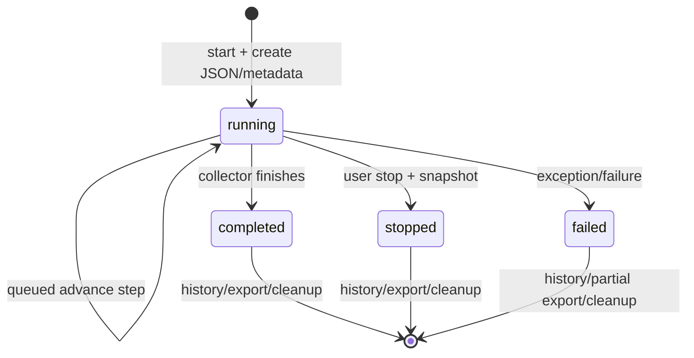

# Parser Run lifecycle

Общий lifecycle используется Telegram, YouTube, Bluesky и Mastodon.

```mermaid
stateDiagram-v2
    [*] --> running: start + create JSON/metadata
    running --> running: queued advance step
    running --> completed: collector finishes
    running --> failed: exception/failure
    running --> stopped: user stop + snapshot
    completed --> [*]: history/export/cleanup
    stopped --> [*]: history/export/cleanup
    failed --> [*]: history/partial export/cleanup
```

## Start и execution

Application Service передаёт context в module `*ParserRunStore`. `ParserRunExecutionCoordinator` под cache lock не допускает второй active run того же module для пользователя, создаёт UUID/initial state, записывает JSON на private disk и синхронизирует `parser_runs` metadata. При queue mode dispatch идёт в `ProcessParserRun`.

Job выполняет один collector step и, если status всё ещё `running`, планирует следующий с `PARSER_RUN_QUEUE_STEP_DELAY_SECONDS`. Таймаут составляет 120 секунд. Ошибка внешнего запроса в queue mode пробрасывается worker для повторения от последнего checkpoint; повторы ограничены тремя исключениями и часовым окном на шаг. Retry deadline хранится в JSON cursor и не обновляется при восстановлении зависшего шага. Ожидание `WithoutOverlapping` не считается исключением. При выключенной queue status request сам вызывает один `advance`; ошибка завершает его с partial snapshot.

## State и storage

- Полный context/cursor/collected data/result snapshot: module JSON file на disk `private`.
- Index/history metadata: `parser_runs` (`run_id`, user, module, status, stage, progress, error, file details, timestamps/expiry).
- `ParserRunFileStorage` сериализует запись через стабильный `.lock` в каталоге пользователя и атомарно заменяет JSON временным файлом из того же каталога. Читатель видит предыдущий или новый полный документ, не ожидая завершения collector step.
- Метаданные синхронизируются до освобождения блокировки. Очистка использует ту же блокировку и повторно проверяет срок хранения; при ошибке удаления запись сохраняется для следующей попытки. Нулевой файл `.lock` сохраняется как стабильный объект синхронизации.
- Внешние вызовы выполняются вне файловой блокировки под отдельным per-run execution lock. Запись шага применяется только если checkpoint всё ещё совпадает с прочитанным: остановка не ждёт сети, а поздний ответ не может перезаписать остановленный запуск.
- Job привязана к версии checkpoint и его retry deadline. Устаревшая job не применяет успешный шаг или failure callback к новой версии; uniqueness locks также разделены по версиям.
- История из DB ограничена `PARSER_RUN_HISTORY_LIMIT` и user/module ownership.

Модульные stages различаются: Telegram собирает messages/comments; YouTube comments/replies; Bluesky profile/feed/followers/follows/interactions; Mastodon statuses/comments.

## Регистрация нового parser module

Module Service Provider регистрирует собственный `JsonRunStore` с tag `JsonRunStore::CONTAINER_TAG` (`parser-run.stores`), а Application Service, реализующий `ParserRunBackgroundProcessorInterface`, с tag этого interface (`parser-run.background-processors`). Shared `ParserSupportServiceProvider` собирает оба registry из tagged services. `ParserRunJobDispatcher` выбирает store по его `module()` и читает durable checkpoint version/deadline перед созданием job. Списка source-specific stores в `AppServiceProvider` нет; новый module не требует правок shared dispatcher/provider.

Registry разрешают services при первом обращении, после регистрации module providers, и отклоняют duplicate или unknown module keys. Store и background processor должны возвращать одинаковый module key. Если новый источник использует opaque page cursors, DTO может использовать pure `PaginationCursorHistory`: источник определяет scopes, reset границы и форму JSON. Существующие YouTube/Mastodon checkpoints сохраняют списки tokens, Bluesky — scoped SHA-256 maps; миграция checkpoint files не требуется.

`JsonRunStore` принимает в file paths только UUID run IDs, созданные lifecycle. Некорректные IDs в read/mutate дают unavailable result до обращения к disk, write их отклоняет. Это закрывает обход user directory через slash/backslash traversal независимо от HTTP route validation.

## Statuses

| Status | Terminal | Exportable | Meaning |
| --- | --- | --- | --- |
| `running` | нет | нет | Сбор продолжается |
| `completed` | да | да | Result snapshot завершён |
| `stopped` | да | да | Пользователь остановил; partial snapshot сохранён |
| `failed` | да | при наличии snapshot | Collector/job завершился ошибкой; сохранённые результаты доступны как неполные |

Stop действует только на `running`, строит snapshot при его отсутствии и сохраняет текущий progress. Ошибка также сохраняет достигнутый progress; 100 означает успешное завершение. Поздний failure callback не меняет `stopped` или `completed`. Неизвестное DB значение нормализуется моделью как `unknown`, но enum lifecycle его не создаёт.

## History и export

History Presenter объединяет DB metadata и доступный JSON payload. Download endpoint проверяет user ownership, downloadable status и наличие snapshot. JSON включает `collection.status` и `collection.complete`; Excel показывает те же признаки в summary. `complete=false` отличает остановленные и ошибочные результаты от успешного сбора. Excel строится module-specific Export Builder поверх shared `ExcelWorkbookService`/sheet definitions.

## Полнота и пагинация

- Telegram не завершает историю по короткой странице; offset обязан двигаться к более старым сообщениям. Keyword и диапазон дат применяются совместно. Ошибка comments не превращается в успешную пустую страницу.
- YouTube проходит все страницы comments и replies, включая пустую промежуточную страницу с next token, и удаляет дубликаты embedded/fetched replies. История tokens сохраняется в checkpoint отдельно для comments и текущей reply thread.
- Mastodon сохраняет roots для comments со всех страниц statuses и восстанавливает их из уже сохранённых statuses старых checkpoints.
- Bluesky сохраняет frontier вложенных replies и догружает ветки глубже одного API-ответа; checkpoint хранит также feed/follower/follow/interaction cursors.

Повторяющийся cursor, цикл курсоров, недостоверный ответ или недоступная ветка вызывают явную ошибку, сохраняя предыдущий checkpoint, вместо зацикливания или ложного `completed`. Полнота относится к данным, доступным через API в выбранном сценарии; скрытые, удалённые и недоступные данные источник может не отдавать.

## Cleanup и retention

Metadata synchronizer задаёт expiry по retention. Scheduled `app:cleanup-parser-runs` выбирает expired rows batches, удаляет соответствующий private file и DB row. `--dry-run` ничего не удаляет. Истёкшие runs не входят в history query.

## Failure modes

Misconfigured credentials, external API errors, quota/rate limit, malformed/expired file и timeout приводят к unavailable/failed flows с partial snapshot, если checkpoint доступен.

При queue mode `start` или `status` повторно отправляет задачу зависшего `running` запуска после `max(150 seconds, stepDelay + 30 seconds)` без изменения данных checkpoint. Execution lock исключает восстановление выполняющегося шага, а cooldown ограничивает повторную отправку. Если часовое retry window шага истекло, запуск завершается `failed` с partial snapshot. После восстановления worker и открытия страницы запуск продолжается с сохранённого cursor. Автономного scheduler reconciler нет: восстановление инициируется `start`/`status`. `stopped` и `failed` остаются terminal; отдельного resume endpoint для них нет.

## Критерий проверенного результата

Для всех четырёх парсеров локальные тесты проверяют сохранение checkpoint и результатов страниц, отсутствие дубликатов/циклов, partial export, terminal-state protection и восстановление зависшего running. Для Telegram дополнительно проверяется граница публичного доступа; HTTP download tests проверяют ownership и защиту активных документов. Перед пилотом нужны smoke tests реальных включённых API и worker: start → несколько шагов → stop/export, а также восстановление после прерывания worker в пределах retry window.
